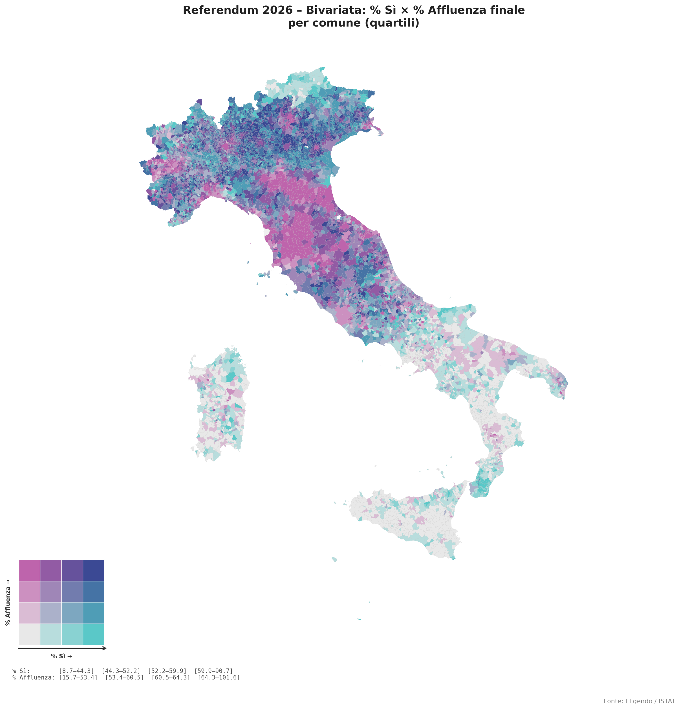

# referendum-download

CLI Python per scaricare i dati dei referendum italiani da [Eligendo](https://elezioni.interno.gov.it) (`eleapi.interno.gov.it`) in formato JSONLines e CSV.

Scarica scrutini e affluenza per tutti i comuni italiani, con supporto per livelli geografici aggregati (province, regioni), più i dati dell'estero.

## Dati

Referendum del 22 marzo 2026:

| File | Descrizione | Stato |
|------|-------------|-------|
| [lookup_eligendo_istat.csv](https://raw.githubusercontent.com/ondata/referendum-download/main/lookup/lookup_eligendo_istat.csv) | Mappa codici Eligendo → ISTAT: utile per unire questi dati con altre fonti che usano i codici ISTAT comunali | disponibile |
| [affluenza.csv](https://raw.githubusercontent.com/ondata/referendum-download/main/data/20260322/affluenza.csv) | Affluenza per comune alle 4 rilevazioni | disponibile |
| [scrutini_flat.csv](https://raw.githubusercontent.com/ondata/referendum-download/main/data/20260322/scrutini_flat.csv) | Scrutini per comune per quesito | non ancora disponibili |
| [scrutini_province_flat.csv](https://raw.githubusercontent.com/ondata/referendum-download/main/data/20260322/scrutini_province_flat.csv) | Scrutini per provincia per quesito | non ancora disponibili |
| [scrutini_regioni_flat.csv](https://raw.githubusercontent.com/ondata/referendum-download/main/data/20260322/scrutini_regioni_flat.csv) | Scrutini per regione per quesito | disponibile |
| [enti_estero.jsonl](https://raw.githubusercontent.com/ondata/referendum-download/main/data/20260322/enti_estero.jsonl) | Lista nazioni e ripartizioni estero | disponibile |
| [scrutini_estero_flat.csv](https://raw.githubusercontent.com/ondata/referendum-download/main/data/20260322/scrutini_estero_flat.csv) | Scrutini per nazione estero per quesito | disponibile |
| [affluenza_estero.csv](https://raw.githubusercontent.com/ondata/referendum-download/main/data/20260322/affluenza_estero.csv) | Affluenza estero per ripartizione geografica | disponibile |

## Requisiti

- Python >= 3.9
- [uv](https://docs.astral.sh/uv/) (consigliato) oppure pip

## Installazione

```bash
git clone https://github.com/ondata/referendum-download.git
cd referendum-download
uv venv .venv
source .venv/bin/activate
uv pip install -e .
```

## Uso

```bash
# Scarica tutti i dati
referendum-download 20260322

# Oppure passa l'URL completo
referendum-download https://elezioni.interno.gov.it/risultati/20260322/referendum/scrutini/italia/italia

# Solo affluenza (es. aggiornamento alle 19:00)
referendum-download --solo-affluenza --force 20260322

# Solo scrutini (es. dopo chiusura seggi)
referendum-download --solo-scrutini --force 20260322

# Scrutini per provincia
referendum-download --solo-scrutini --livello pr 20260322

# Scrutini per regione
referendum-download --solo-scrutini --livello rg 20260322

# Test con pochi comuni
referendum-download --solo-scrutini --limit 10 --delay 0.3 20260322

# Dati estero (scrutini per nazione + affluenza per ripartizione)
referendum-download --estero 20260322

# Solo scrutini estero
referendum-download --estero --solo-scrutini 20260322

# Solo affluenza estero
referendum-download --estero --solo-affluenza 20260322
```

In alternativa, con `uv run` senza attivare il venv:

```bash
uv run referendum-download 20260322
```

### Opzioni

| Opzione | Default | Descrizione |
|---------|---------|-------------|
| `--output-dir` | `data` | Directory di output |
| `--delay` | `1.0` | Pausa in secondi tra le chiamate API |
| `--limit` | `0` | Numero massimo di comuni (0 = tutti) |
| `--force` | off | Forza re-download anche se i file esistono già |
| `--solo-scrutini` | off | Scarica solo gli scrutini, salta affluenza |
| `--solo-affluenza` | off | Scarica solo l'affluenza, salta scrutini |
| `--workers` | `4` | Chiamate parallele per gli scrutini (solo `--livello cm`) |
| `--livello` | `cm` | Livello geografico scrutini: `rg`=regioni, `pr`=province, `cm`=comuni |
| `--estero` | off | Scarica anche i dati estero (enti, scrutini per nazione, affluenza) |

## Struttura della cartella `data`

```
data/
├── {YYYYMMDD}/                      # una sottocartella per tornata elettorale
│   ├── enti.jsonl
│   ├── scrutini.jsonl               # scrutini comuni (--livello cm)
│   ├── scrutini_flat.jsonl
│   ├── scrutini_flat.csv
│   ├── scrutini_province.jsonl      # scrutini province (--livello pr)
│   ├── scrutini_province_flat.jsonl
│   ├── scrutini_province_flat.csv
│   ├── scrutini_regioni.jsonl       # scrutini regioni (--livello rg)
│   ├── scrutini_regioni_flat.jsonl
│   ├── scrutini_regioni_flat.csv
│   ├── affluenza.csv
│   ├── enti_estero.jsonl            # nazioni e ripartizioni estero
│   ├── scrutini_estero.jsonl        # scrutini per nazione estero
│   ├── scrutini_estero_flat.jsonl
│   ├── scrutini_estero_flat.csv
│   └── affluenza_estero.csv
└── lookup_eligendo_istat.csv        # copia della lookup (generata da lookup/)
```

Ogni tornata è identificata dalla data nel formato `YYYYMMDD` (es. `20260322`).

## Output

I file vengono salvati in `data/{YYYYMMDD}/`:

| File | Descrizione |
|------|-------------|
| `enti.jsonl` | Lista completa delle entità territoriali (regioni, province, comuni) |
| `scrutini.jsonl` | Scrutini raw per comune (+ estero) |
| `scrutini_flat.jsonl` / `.csv` | Scrutini comuni appiattiti: una riga per comune per quesito |
| `scrutini_province.jsonl` | Scrutini raw per provincia |
| `scrutini_province_flat.jsonl` / `.csv` | Scrutini province appiattiti: una riga per provincia per quesito |
| `scrutini_regioni.jsonl` | Scrutini raw per regione |
| `scrutini_regioni_flat.jsonl` / `.csv` | Scrutini regioni appiattiti: una riga per regione per quesito |
| `affluenza.csv` | Affluenza per comune alle 4 rilevazioni (12:00, 19:00, 23:00, finale) |
| `enti_estero.jsonl` | Lista nazioni (tipo=`NA`) e ripartizioni (tipo=`ER`) estero |
| `scrutini_estero.jsonl` | Scrutini raw per nazione estero |
| `scrutini_estero_flat.jsonl` / `.csv` | Scrutini estero appiattiti: una riga per nazione per quesito |
| `affluenza_estero.csv` | Affluenza estero per livello (totale estero + ripartizioni) |

### Struttura `scrutini_flat.jsonl`

Ogni riga contiene:

```
cod, cod_istat, area, livello, cod_reg, cod_prov, cod_com,
desc_com, desc_prov, desc_reg,
elettori_m, elettori_f, elettori_t, sezioni_tot,
quesito_cod, sezioni_perv,
votanti_m, votanti_f, votanti_t, perc_vot,
sk_bianche, sk_nulle, sk_contestate,
voti_si, voti_no, perc_si, perc_no
```

`cod_istat` è il codice ISTAT a 6 cifre del comune (es. `015146`), ricavato dalla lookup table `lookup/lookup_eligendo_istat.csv`.

### Struttura `scrutini_estero_flat.jsonl`

Ogni riga contiene:

```
cod, livello, cod_rip, desc_rip, cod_naz, desc_naz,
elettori_t, sezioni_tot,
quesito_cod, sezioni_perv,
votanti_t, perc_vot,
sk_bianche, sk_nulle, sk_contestate,
voti_si, voti_no, perc_si, perc_no
```

`cod_rip` / `cod_naz` corrispondono ai codici Eligendo della ripartizione e della nazione.

### Struttura `affluenza_estero.csv`

Una riga per livello (estero totale / ripartizione) per ogni rilevazione:

```
livello, cod_rip, desc_rip, elettori_t,
rilevazione, dt_rilevazione,
sezioni_perv, sezioni_tot, votanti_t, perc_vot
```

### Struttura `affluenza.csv`

Una riga per entità (nazionale / regione / provincia / comune) per ogni rilevazione:

```
livello, cod_eligendo, cod_istat, cod_reg, cod_prov, cod_prov_istat,
denominazione, elettori_m, elettori_f, elettori_t,
rilevazione, ora, dt_rilevazione,
sezioni_perv, sezioni_tot, votanti_m, votanti_f, votanti_t, perc_vot
```

L'affluenza per comune usa 1 chiamata API per provincia (110 totali), non per comune.

### Esplorare i dati

Con **DuckDB**:

```bash
# Affluenza ore 12:00 per comune
duckdb -c "
SELECT cod_istat, denominazione, perc_vot
FROM read_csv('data/20260322/affluenza.csv')
WHERE livello = 'comune' AND ora = '12:00'
ORDER BY CAST(REPLACE(perc_vot, ',', '.') AS DOUBLE) DESC
LIMIT 20
"

# Scrutini per comune (dopo lo spoglio)
duckdb -c "
SELECT cod_istat, desc_com, desc_reg, elettori_t, votanti_t, perc_vot, voti_si, voti_no, perc_si
FROM read_json_auto('data/20260322/scrutini_flat.jsonl')
WHERE quesito_cod = 1
ORDER BY desc_reg, desc_com
LIMIT 20
"

# Scrutini estero per nazione
duckdb -c "
SELECT desc_rip, desc_naz, elettori_t, votanti_t, perc_vot, voti_si, voti_no, perc_si
FROM read_csv('data/20260322/scrutini_estero_flat.csv')
WHERE quesito_cod = 1
ORDER BY desc_rip, desc_naz
"
```

## Lookup Eligendo → ISTAT

I codici comunali di Eligendo (formato interno `RRPPPCCCC` a 9 cifre) non coincidono con i codici ISTAT. La tabella `lookup/lookup_eligendo_istat.csv` mappa i due sistemi.

### Come è stata generata

Lo script `lookup/generate_lookup.sh` esegue questi passi:

1. **Scarica gli enti Eligendo** dall'API (`getentiFI`) e filtra i soli comuni (`tipo=CM`)
2. **Scarica i comuni ISTAT** dall'API SITUAS (`pfun=61`) con nomi, codici e belfiore
3. **Normalizza entrambi i lati** per il join:
   - rimuove apostrofi (Eligendo usa `FORLI'` per `FORLÌ`, `DE'` per `de'`)
   - converte trattini in spazi (`GIARDINI-NAXOS` → `GIARDINI NAXOS`)
   - usa `COMUNE_IT` ISTAT (nome solo italiano, senza minoranze linguistiche)
   - usa solo la parte italiana del nome Eligendo per i comuni bilingui (prima del `/`)
4. **Fuzzy join** con [`tometo_tomato`](https://github.com/aborruso/tometo_tomato) su `(regione, comune)`:
   - `--block-prefix 2` limita i confronti a comuni con stesso prefisso a 2 caratteri nella stessa regione
   - `--latinize` normalizza gli accenti prima del confronto
   - threshold default (85/100)
5. **Deduplicazione**: se due codici Eligendo matchano lo stesso cod_istat, vince quello con score più alto; l'altro riceve NULL
6. **Override manuali** per comuni fusi non risolvibili automaticamente (CASTEGNERO e NANTO → `Castegnero Nanto`, cod `024129`)

### Uso

```bash
# Genera/aggiorna la lookup (richiede: duckdb, tometo_tomato)
bash lookup/generate_lookup.sh

# Oppure usa un file enti.jsonl già scaricato
bash lookup/generate_lookup.sh data/20260322/enti.jsonl
```

Output: `lookup/lookup_eligendo_istat.csv` con colonne `cod_eligendo`, `nome_eligendo`, `nome_istat`, `regione`, `cod_istat`, `belfiore`, `match_score`.

Copertura: 7895/7895 comuni (100%). Score minimo: 90.0.

## Idempotenza

Ogni file viene saltato se già presente. Per forzare il re-download:

```bash
referendum-download --force 20260322           # tutto
referendum-download --force --solo-affluenza 20260322  # solo affluenza
```

## Mappa bivariata

Lo script [`mappe/bivariate/bivariate_map.py`](mappe/bivariate/bivariate_map.py) genera una **mappa choropleth bivariata** che incrocia simultaneamente due variabili per comune:

- **% Sì** (asse orizzontale): quota di voti favorevoli sul totale dei voti validi
- **% Affluenza** (asse verticale): quota di votanti sul corpo elettorale

La lettura incrociata permette di distinguere, ad esempio, i comuni dove il Sì è alto *e* l'affluenza è alta (colore scuro blu-viola) da quelli dove il Sì è alto ma l'affluenza è bassa (teal), o viceversa. La palette è ispirata allo schema Stevens teal × pink/violet.

L'immagine sotto usa **4 classi** (quartili); lo script di default usa **5 classi** (quintili), configurabile tramite `N = 5` nella sezione CONFIG.



Per la documentazione completa e le opzioni di personalizzazione (numero di classi, filtro regionale, palette) vedi [`mappe/bivariate/README.md`](mappe/bivariate/README.md).

## Chi ha usato questi dati

- Raffaele Mastrolonardo, Sky TG24 — [Referendum sulla giustizia, la vittoria del No raccontata in 3 mappe](https://tg24.sky.it/politica/2026/03/23/referendum-giustizia-risultati-dati) (23 marzo 2026)
- Raffaele Mastrolonardo, Sky TG24 — [Referendum sulla giustizia, l'affluenza raccontata in 3 grafici](https://tg24.sky.it/politica/2026/03/23/referendum-giustizia-affluenza-dati) (23 marzo 2026)
- David Ruffini, Il Sole 24 Ore Infodata — [Scopri come è andato il referendum costituzionale: la mappa comune per comune](https://www.infodata.ilsole24ore.com/2026/03/24/referendum-giustizia-risultati-comuni-mappa-voto-italia/) (24 marzo 2026)
- Guenter Richter — [Mappa dei voti in più del Sì o del No per Comune](https://gjrichter.github.io/viz/Stage/referendum-peaks-2026-reg.html)
- Simone Casciano, IlT Quotidiano — [Referendum, ecco la mappa che incrocia affluenza e voto, oltre la dicotomia città-valli. Il «No» ha mobilitato più del «Sì»](https://www.iltquotidiano.it/articoli/referendum-ecco-la-mappa-che-incrocia-affluenza-e-voto-oltre-la-dicotomia-citta-valli-il-no-ha-mobilitato-piu-del-si/) (26 marzo 2026)
- Redazione, Lettera emme — [Referendum, la mappa del no nella provincia di Messina](https://www.letteraemme.it/referendum-la-mappa-del-no-nella-provincia-di-messina/) (24 marzo 2026)
- Raffaele Mastrolonardo, Sky TG24 — [Anche in Italia le grandi città votano diversamente dal resto del Paese](https://tg24.sky.it/politica/2026/03/26/risultati-referendum-giustizia-voto-citta) (26 marzo 2026)
- Davide Ruffini, Il Sole 24 Ore Infodata — [Referendum, quanti "No" e quanti "Sì" nel tuo comune? Ecco la mappa](https://www.infodata.ilsole24ore.com/2026/03/28/referendum-quanti-no-e-quanti-si-nel-tuo-comune-ecco-la-mappa/) (28 marzo 2026)
